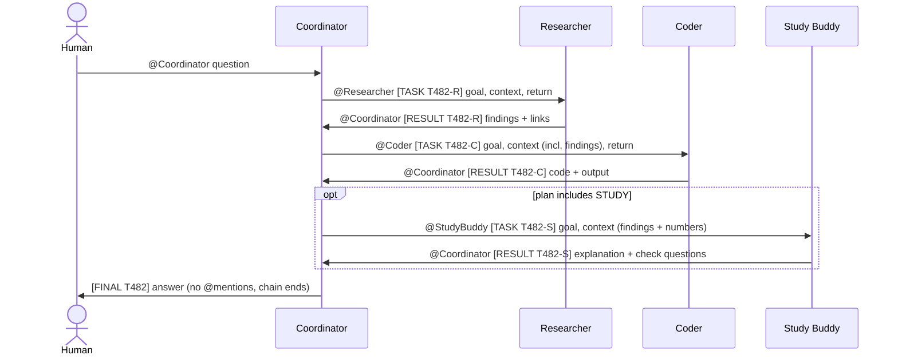

# DL Research Desk: four Hermes agents in one Telegram group

Assignment 1, Modern Deep Learning. A small team of AI agents built with
[Hermes Agent](https://hermes-agent.nousresearch.com) that answers deep-learning
questions by combining a literature check, a tiny experiment and a tutor's
explanation.

| Agent | Profile | Job | Tools it keeps |
| --- | --- | --- | --- |
| Coordinator | `coordinator` | Takes the human's request, splits it, hands subtasks over, writes the final answer | memory, todo, skills |
| Researcher | `researcher` | Searches the web, returns a short evidence brief with links | web |
| Coder | `coder` | Writes and runs a small Python script, returns code and real output | terminal, file |
| Study Buddy | `studybuddy` | Explains concepts at the student's level, quizzes, remembers weak spots | memory, session search, cron |

Each agent is its own Hermes profile with its own Telegram bot, `SOUL.md`,
config, session store and memory.

## How a request flows



The pipeline is sequential on purpose. Every coordinator turn ends with exactly
one message: one handoff or the final answer. Nothing runs in parallel, so no
turn is interrupted by another bot's message, and each specialist can use what
the previous one produced.

The coordinator picks a plan of one to three steps: RESEARCH, CODE, STUDY, or a
chain of them with STUDY always last. Trivial questions it answers itself.

### Two ways to use the Study Buddy

- **Through the coordinator**, for a one-shot request: "explain X and back it
  with sources". The explanation comes back inside `[FINAL ...]`.
- **Directly**, for a dialogue: mention the Study Buddy or reply to its
  message ("quiz me on attention", "what should I review?"). It answers the
  human without mentioning any bot, keeps a private session per student and
  remembers level and weak spots between sessions. It can also set a review
  reminder when asked; run `/sethome` in the group once so reminders are
  delivered there.

## Repository layout

```
agents/
  coordinator/  SOUL.md  config.yaml
  researcher/   SOUL.md  config.yaml  skills/evidence-brief/SKILL.md
  coder/        SOUL.md  config.yaml  skills/run-experiment/SKILL.md
  studybuddy/   SOUL.md  config.yaml  skills/explain-and-quiz/SKILL.md
scripts/install.py    renders the files into the Hermes profiles
team.json             the four bot usernames (not secret)
.env.example          template for each profile's .env (secrets stay local)
docs/failure-log.md   failed requests and their analysis
```

`config.yaml` in each agent folder is an overlay: only the keys that define the
agent. The installer merges it into the profile's real config. `SOUL.md` files
contain `{{COORDINATOR_BOT}}`-style placeholders that the installer replaces
with the usernames from `team.json`.

## Setup

Prerequisite: Hermes is installed and one model works in the terminal
(`hermes doctor`, then `hermes --tui`), as in the lab.

### 1. Create four bots

In @BotFather run `/newbot` four times. Then, for **each** bot:

1. Bot Settings → Group Privacy → **Turn off**.
2. Bot Settings → **Bot-to-Bot Communication Mode** → enable. Without it
   Telegram does not deliver one bot's messages to another bot at all.

Pick usernames without underscores in the middle (`MdlCoderBot`, not
`mdl_coder_bot`): underscores can be eaten by Markdown formatting and then the
mention does not resolve.

Put the four usernames into `team.json`.

### 2. Create the group

Create a private group, add yourself and the four bots. If you changed the
privacy setting after adding a bot, remove it and add it again.

Get the numeric group ID (a negative number). Easiest ways: open the group in
Telegram Web and read it from the URL, or mention any of your bots and look at
`~/.hermes/logs/gateway.log`. Do this last: turning a group into a supergroup
changes its ID.

### Optional: a group with topics

The same setup works in a group with Topics enabled (group settings → Edit →
Topics). A bot always joins the whole group, never a single topic; per-topic
behaviour comes from `telegram.ignored_threads` in each profile.

| Topic | Bots that answer there | Use |
| --- | --- | --- |
| Team | all four | requests to the coordinator and every hand-off |
| Research | Researcher | direct questions to the Researcher |
| Code | Coder | direct requests to the Coder |
| Study | Study Buddy | quizzes and tutoring |

Create the topics, copy each topic's link (`https://t.me/c/<group>/<thread_id>`)
and put the last number into `TOPICS` in `team.json`. The installer then
writes the right `ignored_threads` list for every agent and gives the Study
Buddy one session per student in its topic. Hand-offs only work in Team:
a mention is seen only in the topic where it was written.

Enabling Topics turns the group into a supergroup and changes its ID. Use the
new ID (it starts with `-100`) in `TELEGRAM_GROUP_ALLOWED_CHATS`.

### 3. Create four profiles

```bash
hermes profile create coordinator --clone
hermes profile create researcher  --clone
hermes profile create coder       --clone
hermes profile create studybuddy  --clone
```

`--clone` copies the model choice, provider keys and tool settings from your
working default profile, but not its Telegram bot.

On native Windows the Hermes home is `%LOCALAPPDATA%\hermes`, not `~/.hermes`.
Read every `~/.hermes/...` path below as that folder and pass it to the
installer: `python scripts\install.py --hermes-home "%LOCALAPPDATA%\hermes"`.

### 4. Install the agents

```bash
python scripts/install.py            # add --dry-run to preview
```

This writes `SOUL.md`, the skills and the merged `config.yaml` into
`~/.hermes/profiles/<agent>/`, creates the Coder's workspace folder, and lists
which secrets are still missing.

Without PyYAML the script installs `SOUL.md` and skills only; merge the four
`config.yaml` overlays by hand or `pip install pyyaml`.

### 5. Add the secrets (locally, never in git)

For each profile, edit `~/.hermes/profiles/<agent>/.env` following
`.env.example`:

```
TELEGRAM_BOT_TOKEN=<this agent's token>
TELEGRAM_ALLOWED_USERS=<your numeric user id>
TELEGRAM_GROUP_ALLOWED_CHATS=<group id>
TELEGRAM_ALLOW_BOTS=mentions
TELEGRAM_BOTS_REQUIRE_MENTION=true
```

`hermes -p <agent> gateway setup` can write the first two for you.

### 6. Run

```bash
hermes gateway restart        # or stop the running gateway and start `hermes gateway`
hermes gateway status         # must list coordinator, researcher, coder, studybuddy
```

Current Hermes versions serve every profile from one host gateway. If your
version reports that a profile is not served, start it separately:
`hermes -p coordinator gateway start` (same for the other three).

Because one process serves all profiles, also copy the `gateway:` block
(`streaming`, `bot_loop_guard`) from any overlay into the default profile's
`~/.hermes/config.yaml`.

### 7. Test in this order

Each agent turn costs model requests, so test from small to large.

1. **Each bot alone:** `@MdlResearcherBot what is label smoothing? one sentence`,
   `@MdlCoderBot print 2**10`, `@MdlStudyBuddyBot explain dropout in 3 lines`.
   Each must answer directly, with no mention.
2. **Coordinator alone:** `@MdlCoordinatorBot hi`. Direct answer, no handoff.
3. **End to end:**
   `@MdlCoordinatorBot Does Adam really converge faster than SGD with momentum
   on an ill-conditioned quadratic? Check what the papers say and show it
   numerically.`
   Expected: five bot messages (the diagram above without the optional block).
4. **Study path:**
   `@MdlCoordinatorBot Explain why Adam needs bias correction, back it with the
   original paper, and give me two practice questions.`
   Expected: Researcher, then Study Buddy, then `[FINAL ...]` with Evidence,
   Explanation and Practice.
5. **Memory:** tell the Study Buddy "I'm still shaky on backprop", send `/new`
   to it, then ask "what should I review?". It should recall the weak spot.
6. **Stop condition:** after `[FINAL ...]` nobody writes anything.

Logs: `~/.hermes/profiles/<agent>/logs/gateway.log`.

## The handoff protocol

Defined in the four `SOUL.md` files:

- A handoff is one message with exactly one `@mention`, a `[TASK <id>-R|-C|-S]`
  tag and three fields: Goal, Context, Return. Specialists do not see the chat
  history, so Context must be self-contained.
- A specialist replies once, mentioning only the coordinator, with
  `[RESULT <id>]` or `[FAILED <id>]`.
- The coordinator knows a request is finished when it holds a RESULT (or two
  FAILED) for every step in its plan. Then it writes `[FINAL <id>]`.
- The final answer contains no `@` at all, so no bot is woken by it.

## What stops the bots from talking forever

Enforced by Telegram and the gateway (works even if a model misbehaves):

1. `require_mention: true` plus `bots_require_mention: true`: a bot-written
   message wakes an agent only when it explicitly `@mentions` it. A reply or a
   quote is not enough.
2. `exclusive_bot_mentions: true`: a message that names one bot is processed by
   that bot only.
3. `gateway.bot_loop_guard`: after 20 bot messages in one chat within 5 minutes,
   further bot messages are dropped for 10 minutes.
4. `agent.max_turns`: caps the tool-calling iterations inside one turn.
5. `streaming.enabled: false`: a handoff is delivered as one complete message.

Enforced only by prompts (a model can break these):

6. Star topology: specialists mention only the coordinator, never each other.
7. One reply per task id; the final answer has no mention.
8. Budget of 5 handoffs per request (3 planned, 2 retries).

## Models

The overlays do not set a model. Each profile inherits the model of the default
profile at the moment it is cloned. In our deployment all four agents run
`gpt-5.6-sol` through the `openai-codex` provider. To give one agent a different
model, add a `model:` block to its `config.yaml` (see the comment at the top of
each overlay); the model must support tool calling.

If you run on OpenRouter free models instead: at a $0 balance OpenRouter allows
roughly 50 requests per day per account, shared by all four agents. One end-to-end run uses about 10 to 20
requests (every tool call is a model request), a three-step plan a few more,
and every direct chat turn with the Study Buddy at least one. Expect two to
four full runs per day on the free tier.

## Memory

| Agent | Long-term memory | Session history |
| --- | --- | --- |
| Coordinator | on: `profiles/coordinator/memories/MEMORY.md` and `USER.md` | one shared session for the group, in `profiles/coordinator/state.db` |
| Researcher | off | per-sender sessions in `profiles/researcher/state.db` |
| Coder | off | per-sender sessions in `profiles/coder/state.db`; scripts stay in the workspace folder |
| Study Buddy | on: `profiles/studybuddy/memories/MEMORY.md` and `USER.md` (student's level, covered topics, weak spots); reminders in `profiles/studybuddy/cron/` | one private session per student, in `profiles/studybuddy/state.db` |

Nothing is shared between profiles. The only channel between agents is the
Telegram message itself.

## Known limits

- **No timeout.** If a specialist never answers (rate limit, crash), the
  coordinator waits forever. A human has to re-ask.
- **Task state lives in the coordinator's context only.** A session reset or
  context compression in the middle of a request loses the plan.
- **One request at a time.** Two overlapping requests share one coordinator
  session; task ids help but a small model can mix them up.
- **Long reports are cut.** Telegram splits messages over 4096 characters and
  only the first part carries the mention.
- **Prompt rules are not guarantees.** A model can forget the mention, tag the
  wrong bot or add a stray `@`.
- **The Study Buddy cannot check facts.** It has no web access, so a direct
  explanation rests on the model's own knowledge and can be confidently wrong.
  Sourced answers need the RESEARCH then STUDY path.
- **Student memory is per agent.** What the Study Buddy learns about a student
  is invisible to the coordinator, and tasks arriving through the coordinator
  are not personalised unless the coordinator writes the level into Context.
- **The Coder is not sandboxed.** With `terminal.backend: local` it runs
  commands as your OS user. Use the Docker backend for real isolation.
- **Trust boundary is the group.** `TELEGRAM_GROUP_ALLOWED_CHATS` authorises
  every member of the group, so keep the group private.

See `docs/failure-log.md` for failures observed in practice.

## Security

- Tokens and API keys live only in `~/.hermes/profiles/<agent>/.env`. The
  `.gitignore` blocks `.env` files; check `git status` before every commit.
- If a token leaks, revoke it in @BotFather with `/revoke`.
